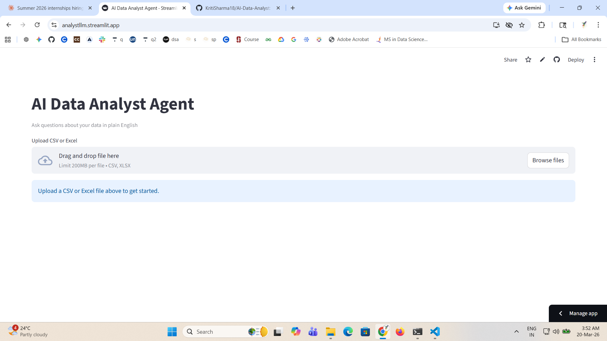

# AI Data Analyst Agent

Upload any CSV or Excel file and ask questions about it in plain English — 
no SQL, no code required.

## Live Demo
🔗 [Try it here](https://analytllm.streamlit.app)



## Features
- Natural language querying over any tabular dataset
- Supports CSV and Excel formats
- Auto-displays row count, column count, and missing values
- Powered by LLaMA 3.3 via Groq API

## Tech Stack
Python · Streamlit · Pandas · Groq API · LLaMA 3.3

## Run Locally
```bash
pip install -r requirements.txt
streamlit run ai_data_analyst.py
```

For local version, install [Ollama](https://ollama.com) and run:
```bash
ollama pull llama3.2:3b
ollama serve
```

## Example Questions
- *"What is the average age in this dataset?"*
- *"Which column has the most missing values?"*
- *"How many rows have sales greater than 1000?"*

## Future Improvements
- [ ] Auto-generate charts from query results
- [ ] SQL-style query support
- [ ] Multi-file analysis
- [ ] Export answers to PDF
